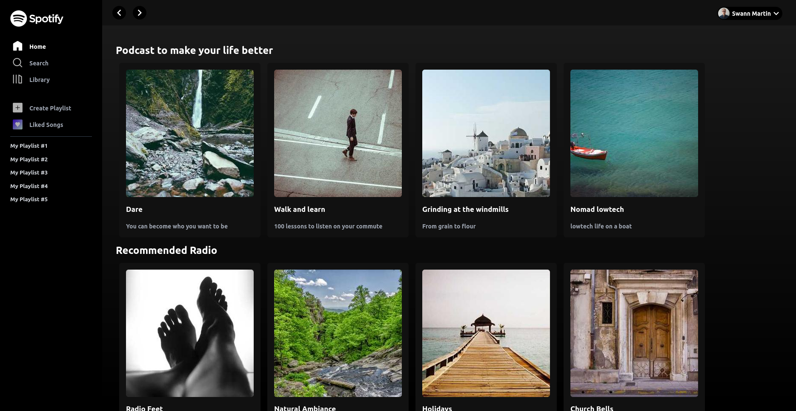
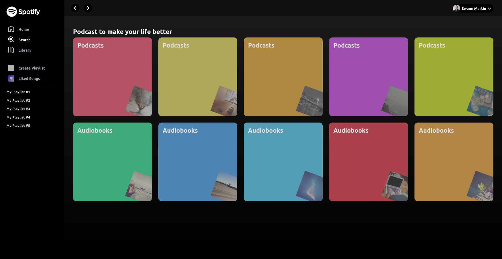
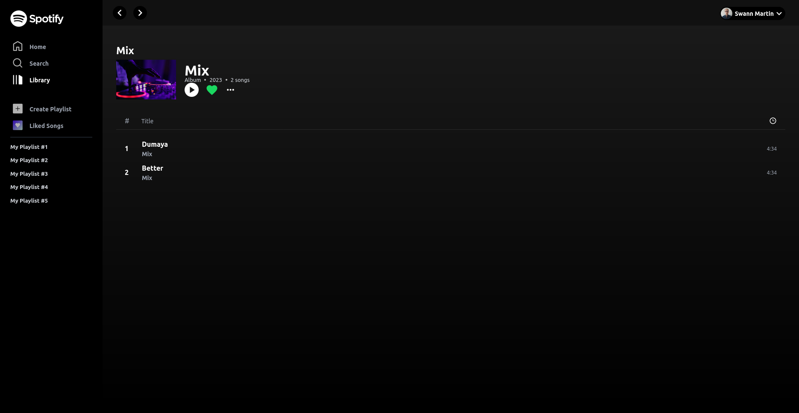

# spotify-clone

This project was made following a [youtube tutorial](https://www.youtube.com/watch?v=ZzuqwqP1wAQ) from the channel [John Weeks Dev](https://www.youtube.com/@johnweeksdev). The aim was to make a spotify clone using Vue 3, pinia, tailwind and assets musics. I just wanted to learn more about Vue.





## Customize configuration

See [Vite Configuration Reference](https://vitejs.dev/config/).

## Project Setup

```sh
pnpm install
```

### Compile and Hot-Reload for Development

```sh
pnpm dev
```

### Compile and Minify for Production

```sh
pnpm build
```

s
